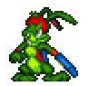
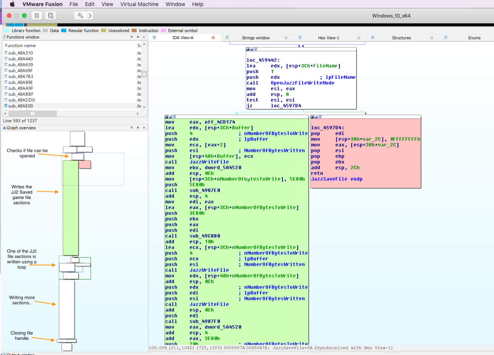
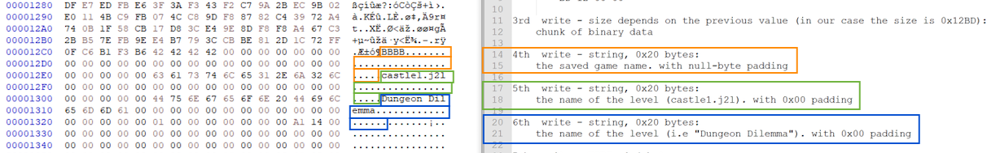
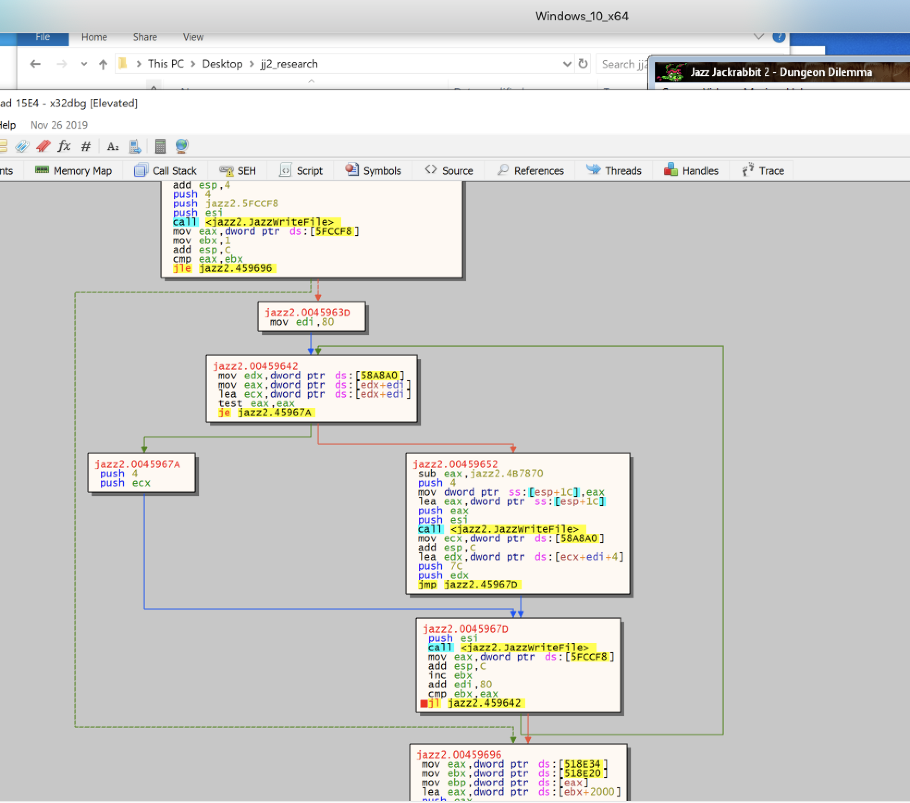
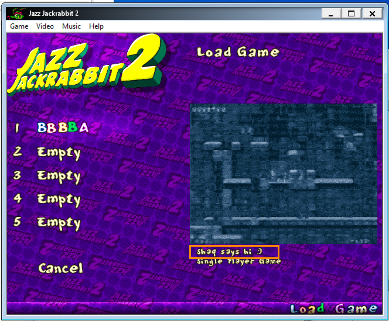
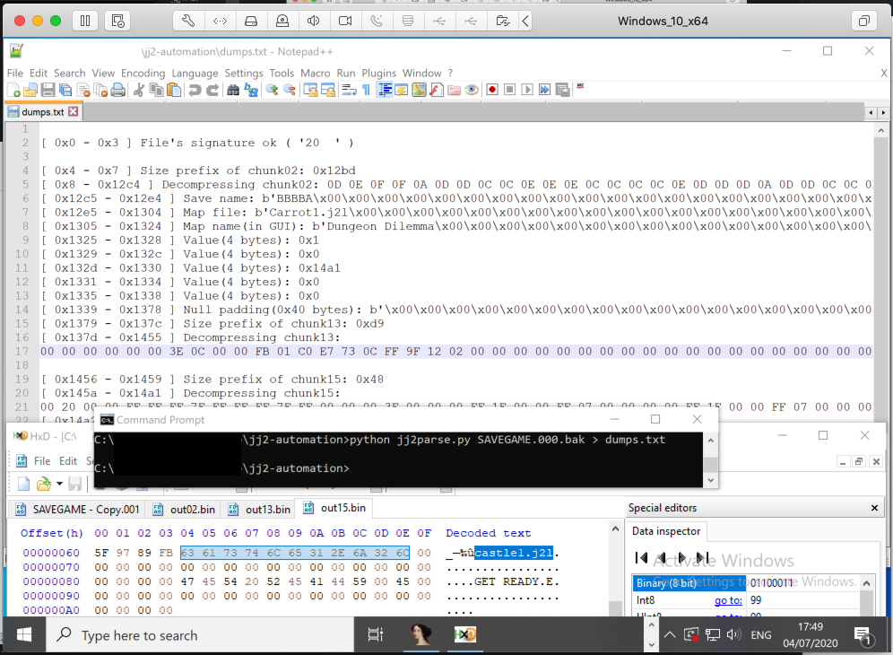

# Reverse Engineering Jazz Jackrabbit 2

*Jazz Jackrabbit 2* is a nostalgic platform game produced by [Epic Games](https://en.wikipedia.org/wiki/Epic_Games). 

I decided to try and reverse engineer the game since it was one of my favorite games back in the days (:

## The saved game format

>*"The saved game format for Jazz Jackrabbit is exceedingly complex and the files themselves contain the string 'Figure diz out, greetz arjan' an open invitation from the game's programmer
to try and crack it."*
   http://www.shikadi.net/moddingwiki/Jazz_Jackrabbit_Saved_Game_Format

My attempt is below

## Step 1 - Find the "saved game" file for analysis
The saved games can be found in the game's directory. Under the name "SAVEGAME.000" ... "SAVEGAME.001" ... and so on

## Step 2 - Identify the subroutine that saves the state of the game 
After doing a lot of x-refs on WinAPI calls(like opening a file, writing, etc.), I finally found it.

It's triggered when the user clicks on "save game"

On the left side, at the "*Graph Overview*" pane you can see the all of the stages that the subroutine
performs.  

I did some re-naming to the function names and managed to get 
a clear view of what that thing is doing. And more importantly, to understand the saved game file format. 

The graph above can be found at: [JazzSaveFile.asm](./JazzSaveFile.asm)

The output file can be found at: [SAVEGAME.000](./SAVEGAME.000)

## Step 2.1 - Let's break it down 
So basically what happens in the ``JazzSaveFile`` function is:

* It calls 16 times to ``JazzWriteFile`` to write the first "sections" of the save game file.
The ``JazzWriteFile`` function gets a file handle, size and buffer to copy (from the game's memory to the saved game file). 

* Performs a loop to write the 17th section with a size prefix at the beginning

* It calls 6 more times to ``JazzWriteFile`` to write 6 last sections.

Total number of "sections" in ``JazzWriteFile``: 23

## Step 3 - Dynamic analysis 
After spotting the place of the function in IDA, i moved to the debugger(x32dbg) to put a breakpoint
and step-through the calls of ``JazzWriteFile`` inside our [JazzSaveFile.asm](./JazzSaveFile.asm) function. 

Finally, I managed 
to understand the format of the file.

Some of the chunks have fixed size like those ones:

And some of them have dynamic size, with a prefix that defines their length.

Lucky for you, I mapped every call and listed everything here (all the 23 calls) from my dynamic analysis session:

| Chunk No. | Value                                                                                  | Length(in bytes)    | Meaning                               |
|----------|----------------------------------------------------------------------------------------|---------------------|---------------------------------------|
| 0        | "23  "                                                                                 | 4                   | The JJ2 Version / magic bytes         |
| 1        | ``43 11 00 00``                                                                            | 4                   | Size of the next write                |
| 2        | Beings with: ``78 DA BD 5B ``                                                              | 0x1143              | Compressed data(zlib)          |
| 3        | "AAAAA" followed by 15 null-bytes(padding)                                             | 0x20                | The saved game name                   |
| 4        | "castle1.j2l"                                                                          | 0x20                | Map file to load                      |
| 5        | "Shaq says hi :)" followed by nullbytes (for padding)                                  | 0x20                | Level name                            |
| 6        | 0x00000001                                                                             | 0x4                 | unknown flag                          |
| 7        | 0x00000000                                                                             | 0x4                 | unknown flag                          |
| 8        | ``8B 18 00 00``                                                                            | 0x4                 | unknown purpose                       |
| 9       | 0x00000000                                                                             | 0x4                 | unknown purpose                       |
| 10       | 0x00000000                                                                             | 0x4                 | unknown purpose                          |
| 11       | 0x00 \<repeats 0x40 times\>                                                                             | 0x40                 |   null padding                          |
| 12       | ``D9 00 00 00``                                                                            | 0X4                 | Size of the next chunk                |
| 13       | Begins with: ``78 DA 63 60``                                                               | 0xD9                | Compressed data(zlib)                          |
| 14       | ``48 00 00 00``                                                                            | 0x4                 | Size of the next chunk                |
| 15       | Beings with: ``78 DA 63 50``                                                               | 0x48                | Compressed data(zlib)                          |
| 16       | ``40 00 00 00 ``                                                                           | 0x4                 | The number of iterations for the loop |
| 17(loop) | Begins with 4 bytes: ``C0 C1 F4 FF`` Followed by 0x7c bytes which begins with: ``00 00 AF 09`` | (0x4 + 0x7c) * 0x40 | looks like an array / list            |
| 18       | ``A3 03 00 00``                                                                            | 0x4                 | Size of the next chunk                |
| 19       | Begins with: ``78 DA ED DD``                                                               | 0x33A               | Compressed data(zlib)                          |
| 20       | ``7A 16 00 00``                                                                            | 0x4                 | Size of the next chunk                |
| 21       | Begins with: ``78 DA 95 3B``                                                               | 0x167A              | Compressed data(zlib)                          |
| 22       | ``0B 00 00 00``                                                                            | 0x4                 | Size of the next chunk                |
| 23       | Begins with: ``78 DA 63 60``                                                               | 0x0B                | Compressed data(zlib)                          |
| eof      | eof                                                                                    | eof                 | eof                                   |

**Explanation about the loop in the 17th write:**

In the 16th write, we wrote the value ``0x40``, this is a size prefix of the next chunk(17). The 17th chunk will be written using a loop. The number of iterations in that loop depends on the prefix (meaning that the loop will run ``0x40`` iterations):

* on each iteration, 4 bytes are written
  * If those 4 bytes(above) have a null value: skip to the next iteration
  * if not null: then **another** 0x7c bytes are written to the ``SAVEGAME`` file.
* Assuming there are no ``null``s: The loop will write a huge chunk of binary data with a total size of ``(0x4 + 0x7c) * (0x40 - 0x1)``. 

In ``SAVEGAME.000``, this chunk begins with the bytes ``C0 C1 F4 FF`` 

This is how the loop actually looks like:

## Step 4 - PoC

To recap, now we know:
* The format of SAVEGAME.000 (Using all of the sizes/offsets listed above)
* Which parts have prefixes of length and which are not. 

Because we know that, we have the abillity to modify, fuzz and pwn the [SAVEGAME.000](./SAVEGAME.000) file without making the game crash 💥

example:
I modified the map's name from ``Dungeon Dilemma`` to ``shaq says hi :)``  (this is **not** a user-controlled string, the game is the one who's supposed to generate this string)

This will usually cause a crash, but because we know the size of the chunks: we can make the game think it's a legitimate savegame file.

>**Note:** This can work on your local ``SAVEGAME`` file too. The information there might be different **but if you follow the 
offsets & definitions** listed above you'll be able to understand where every section starts and ends in any JJ2 Savegame file (v1.23).

## jj2parse.py

Because the content might change from one client to another, it's annoying to manually follow the table above in a Hex-Viewer, look for the size prefixes, calculate offsets and emulate the loop of the 17th chunk. 

This is why I created ``jj2parse.py``, this python script will:

* Parse any ``SAVEGAME.xxx`` file (*JJ2 version 1.23*)
* Detect whenever there's a static or dynamic chunk and determine its size
* Automatically decompress the dynamic zlib content(chunks 2, 13, 15, 19, 21 and 23)
* Save a copy of the zlib decompressed chunks in ``outdir/outXX.bin``(XX == chunk number)
* Save a raw copy of the 17th chunk (still didn't figure out the purpose of this one, it looks like a hash table)  
* Print a Hexdump of the chunks (separated)

example: 

Using the script, it will be a lot easier to reverse engineer the rest of the game.

Use-case / example:

1. Run the script & save the output ( you can pipe it into a file )
2. Go back to the game, use some ammo / shoot 3-4 bullets
3. Go to the menu and click "Save Game". It will overwrite the existing ``SAVEGAME`` file with new data.
4. Run ``jj2parse.py`` again
5. Run *diff* on the output from step 1 and compare it with the output in step 4
6. Using the *diff* output, it will be a lot easier to detect where the information about ammo is stored. 

>**Note**: Manipulating the ammo / bullets was just an example. You can try it on different things too like score, lives, location in the map, etc.

